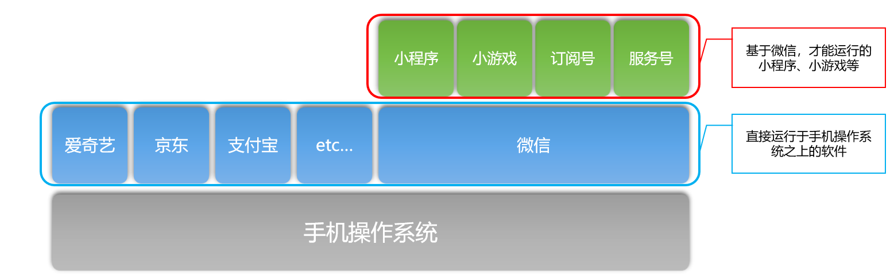
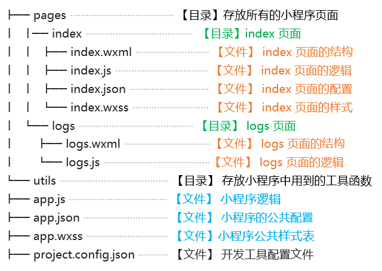

# 小程序公开课 - day1


## 1. 技术の准备

1. HTML + CSS

   + 能够像素级还原UI设计稿
   + 掌握 CSS3 中的 Flex 布局

2. Javascript 基础

   + 数据类型、变量

   + 循环、分支、判断
   + 函数、对象、数组
   + 面向对象\*、ES6\*

3. 了解至少一种前端的 MVVM 框架

   + Vue
   + React
   + Angualr


## 2. 环境の配置

1. 安装 Node.js
2. 安装 Git 源代码管理工具
3. 安装 **微信开发者工具**
4. 申请 微信公众平台的开发者账号


## 3. 必知の基础概念


### 3.1 区分 开放平台 与 公众平台


#### 开放平台 https://open.weixin.qq.com

+ **概念**：微信开放平台是微信对外提供**开放接口**的一个平台，这些开放出来的微信接口，供**第三方的网站**或**App**使用；

+ **开放平台的能力**：对外提供了微信分享、微信支付、微信登录等功能，从而方便第三方的网站或应用调用微信的能力。

+ **注意**：开放平台主要是给后台开发人员使用的。


#### 公众平台 https://mp.weixin.qq.com

+ **概念**：是运营者通过**公众号**这个媒介，为微信用户**提供资讯和服务**的平台；

+ 公众号的具体分类：
  + 订阅号
  + 服务号
  + 企业微信
  + 小程序
  + 小游戏


### 3.2 认识微信小程序

+ **概念**：微信小程序相比于传统的订阅号、服务号来说，用户体验更加出色，它是公众号中的新成员，是连接用户与服务的新媒介。
+ **特点**：体积小、方便获取与传播；用户体验好；
+ **理念**：用完即走；
+ **业务场景**
  + 适合做**用完即走**的应用，例如：点外卖、打车、代驾、共享单车等；
  + 不适合做**重度依赖**的应用，例如：音乐视频播放类、大型手机游戏类等；


### 3.3 小程序与App的区别

+ **App**：直接安装并运行在手机操作系统之上；
+ **小程序**：必须基于手机微信才能安装和运行；




### 3.4 申请小程序开发账号

申请开发账号的教程：https://developers.weixin.qq.com/miniprogram/introduction/index.html?t=18101214

注意：如果只是单纯体验小程序，可以使用 **测试账号**


## 4. 结构&配置


### 4.1 创建小程序项目

①打开小程序开发者工具，用微信扫码登录开发者工具

②点击左侧菜单中的小程序选项

③点击 + 号新建小程序项目

④填写项目名称

⑤选择项目存放路径（必须选择空目录）

⑥填写 AppID

⑦点击新建按钮


### 4.2 认识小程序开发者工具的界面组成结构

开发者工具主界面，从上到下，从左到右，分别为五大部分：

+ 菜单栏

+ 工具栏

+ 模拟器

+ 编辑器

+ 调试器


### 4.3 预览小程序

通过预览功能，可以在真机环境下，快速查看小程序的实际效果

+ 点击 `工具栏` -> `预览` 即可弹出预览窗口

+ 两种预览方式：
  + 扫描二维码预览
  + 自动预览


### 4.4 小程序项目的结构



**注意：**

1. 对于**小程序**来说：**app.js** 和 **app.json** 文件是必须的
2. 对于**小程序的页面**来说：**.js** 和 **.wxml** 文件是必须的


### 4.5 小程序页面的组成部分及作用

每个小程序的页面，是由 **.wxml 结构**、**.js 逻辑**、**.json 配置**、**.wxss 样式表** 这4个文件组成的。

+ **.wxml :** 用来描述当前这个页面的结构，同时提供了类似于Vue中指令的语法

+ **.js :** 用来定义当前页面中用到的数据、交互逻辑和响应用户的操作

+ **.json :** 用来定义当前页面的个性化配置，例如，为每个页面单独配置顶部颜色、是否允许下拉刷新等

+ **.wxss :** 用来定义样式来美化当前的页面


### 4.6 自定制小程序的默认首页

打开 **app.json** 这个全局配置文件，找到 **pages** 节点。这个 pages 节点是一个数组，存储了项目中所有页面的访问路径。其中，**pages 数组中第一个页面路径，就是小程序项目的默认首页**。

只要在 pages 数组的头部，新增一个页面路径，Ctrl + S 保存之后，小程序开发者工具会自动生成对应路径的页面。


### 4.7 全局配置文件 app.json

小程序根目录下的 **app.json** **文件**用来对微信小程序进行**全局配置**，它决定了页面文件的路径、窗口表现、设置网络超时时间、设置多 tab 等。

在app.json配置文件中，最主要的配置节点是：

+ **pages** **数组**：配置小程序的页面路径

+ **window** **对象**：用于设置小程序的状态栏、导航条、标题、窗口背景色

+ **tabBar** **对象**：配置小程序的tab栏效果

更多全局配置文档，请参考：

https://developers.weixin.qq.com/miniprogram/dev/reference/configuration/app.html


## 5. 视图&逻辑


### 5.1 定义数据

小程序页面中的数据，需要在对应页面的 .js 文件中进行定义。只需**把数据定义到** **data** **节点下**即可，示例代码如下：

```js
Page({
  data: {
    info: 'init data', // 字符串类型的数据
    array: [{msg: '1'}, {msg: '2'}] // 数组类型的数据
  }
})
```


### 5.2 数据绑定

把data中的数据绑定到页面中渲染，使用**Mustache** **语法**（双大括号）将变量包起来即可，实例代码如下：

```xml
<!--1. 用在内容节点-->
<view> {{ message }} </view>

<!--2. 用在属性节点-->
<view id="item-{{id}}"> </view>

<!--3. 三元运算-->
<view> {{ flag ? ‘条件为真’ : ‘条件为假’ }} </view>
```


### 5.3 事件绑定

在小程序中，不存在网页中的 onclick 鼠标点击事件，而是通过 **tap** **事件**来响应触摸行为；

通过 bindtap，可以为组件绑定触摸事件，语法如下：

```xml
<view bindtap=“tapName”> Click me! <view>
```

在相应的Page定义中写上相应的事件处理函数，事件参数是event：

```js
Page({
  // 事件处理函数
  tapName: function(event) {
    console.log(event)
  }
})
```


### 5.4 列表渲染

在组件上使用 **wx:for** 控制属性绑定一个数组，即可使用数组中各项的数据**重复渲染**该组件。

默认数组的当前项的下标变量名默认为 **index**，数组当前项的变量名默认为 **item**。

语法示例如下：

```xml
<view wx:for="{{array}}">
  索引是：{{index}} 当前项是：{{item}}
</view>
```


### 5.5 **key** 在列表循环中的作用

如果列表中项目的位置会动态改变或者有新的项目添加到列表中，并且希望列表中的项目保持自己的**特征**和**状态**（如 `<input/>` 中的输入内容，`<checkbox/>` 的选中状态），需要使用 **wx:key** 来**指定列表中项目的唯一的标识符**。

当**数据改变**触发渲染层**重新渲染**的时候，会校正带有 key 的组件，框架会确保他们被重新排序，而不是重新创建，以确保使组件保持自身的状态，并且提高列表渲染时的效率。


## 6. 常用の组件&API


### 6.1 常用组件

- view 视图容器      ->       div
- text 文本               ->       span
- button 按钮          ->       button
- input 输入框         ->       input
- image 图片           ->       img

+ swiper 和 swiper-item

  ```xml
  <!--indicator-dots 是否展示小圆点-->
  <!--circular       是否衔接轮播-->
  <!--autoplay       是否自动轮播-->
  <!--interval       自动轮播的间隔，单位是毫秒，默认每 5000 毫秒轮播一次-->
  <swiper indicator-dots circular autoplay interval='2000'>
    <swiper-item>轮播图1</swiper-item>
    <swiper-item>轮播图2</swiper-item>
    <swiper-item>轮播图3</swiper-item>
  </swiper>
  ```

+ navigator              ->       a 链接

  ```xml
  <!--注意1：跳转到的 URL 地址必须以 / 开头-->
  <!--注意2：可以通过 ? 传递 URL 参数-->
  <navigator url="/pages/test/test?id=3">跳转到 Test 页面</navigator>
  ```

  

### 6.2 常用API

1. [wx.showLoading(Object object)](https://developers.weixin.qq.com/miniprogram/dev/api/ui/interaction/wx.showLoading.html)

   显示 loading 提示框。需主动调用 wx.hideLoading() 才能关闭提示框

   ```js
   wx.showLoading({
       title: '数据加载中...'
   })
   ```

2. [wx.request(Object object)](https://developers.weixin.qq.com/miniprogram/dev/api/network/request/wx.request.html)

   发起 HTTPS 网络请求

   测试  GET  请求的 API 地址 http://www.liulongbin.top:3005/api/get

   测试 POST 请求的 API 地址 http://www.liulongbin.top:3005/api/post

   ```js
   wx.request({
       // 【必选】请求地址
       url: '',
       // 【可选】请求类型，如果省略该参数，则默认发起 GET 请求
       method: 'GET',
       // 【可选】请求参数
       data: {},
       // 【可选】请求成功之后的回调函数
       success: (res) => {},
       // 【可选】请求失败之后的回调函数
       fail: (err) => {},
       // 【可选】请求完成之后的回调函数
       complete: () => {}
   })
   ```

   

## 7. 拓展 - 第三方小程序开发框架


### 7.1 mpvue

官方文档地址：http://mpvue.com/

使用 mpvue 开发小程序，你将在小程序技术体系的基础上获取到这样一些能力：

+ 彻底的组件化开发能力：提高代码复用性
+ 完整的 Vue.js 开发体验
+ 方便的 Vuex 数据管理方案：方便构建复杂应用
+ 快捷的 webpack 构建机制：自定义构建策略、开发阶段 hotReload
+ 支持使用 npm 外部依赖
+ 使用 Vue.js 命令行工具 vue-cli 快速初始化项目
+ H5 代码转换编译成小程序目标代码的能力


### 7.2 WePY

官方文档地址：https://tencent.github.io/wepy/

WePY 框架在开发过程中参考了 Vue 等现有框架的一些语法风格和功能特性，对原生小程序的开发模式进行了再次封装，更贴近于 MVVM 架构模式, 并支持ES6/7的一些新特性。

- **开发风格**：接近于 Vue.js，支持组件 Props 传值，自定义事件、组件分布式复用Mixin、计算属性函数computed、模板内容分发slot等等
- **组件化**：组件化开发，完美解决组件隔离，组件嵌套，组件通信等问题
- **NPM**：支持使用第三方 npm 资源，自动处理 npm 资源之间的依赖关系，完美兼容所有无平台依赖的 npm 资源包
- **Promise**：通过 polyfill 让小程序完美支持 Promise，解决回调烦恼
- **ES2015**：可使用 Generator Fu-nction / Class / Async Function 等特性，大大提升开发效率
- **优化**：对小程序本身的优化，如请求列对处理，优雅的事件处理，生命周期的补充，性能的优化等等
- **编译器**：支持样式编译器：Less/Sass/Styus，模板编译器：wx-ml/Pug，代码编译器：Babel/Typescript。

- **插件**：支持多种插件处理，如文件压缩，图片压缩，内容替换等，扩展简单,使用方便
- **框架大小**：压缩后 24.3KB 即可拥有所有框架功能，额外增加 8.9 KB后即可使用 Promise 和 Async Function

